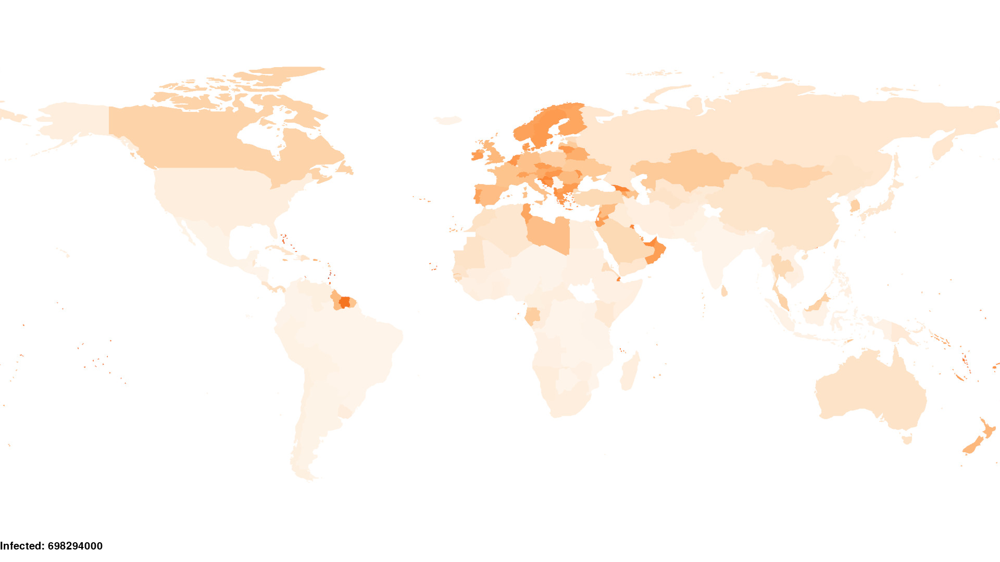
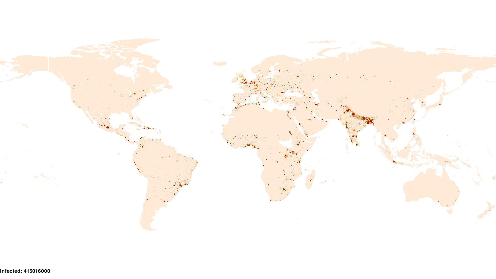

.. role:: raw-html-m2r(raw)
   :format: html

About Pandemia
==============

.. image:: https://github.com/PandemiaProject/pandemia/actions/workflows/end-to-end-tests.yml/badge.svg
   :target: https://github.com/PandemiaProject/pandemia/actions/workflows/end-to-end-tests.yml
   :alt: End to End tests

.. image:: https://readthedocs.org/projects/pandemia/badge/?version=latest
   :target: https://pandemia.readthedocs.io/en/latest/?badge=latest
   :alt: Documentation Status

 

Pandemia is an individual-based stochastic pandemic simulator. It is currently a work in progress.

Pandemia is able to simulate and visualize the spread of an infectious disease across multiple
geographical regions, for example the countries of the world or the administrative divisions of
a country. The model is fast and scalable, able to simulate extremely large numbers of individuals
while supporting a wide range of highly adaptable features.

This software can be used by researchers looking to assess the impact of policy in the context of a
public health emergency caused by an infectious disease of humans. The disease could, for example, be a
respiratory infectious disease spread by a coronavirus or an influenza virus. The emergence and
re-emergence of infectious diseases threatens the health and well-being of people all over the world,
and tools such as Pandemia can play a vital role in supporting pandemic preparedness and response.

This document contains an overview of the model, a quickstart guide and information for
contributors. The full user guide, including a narrative description of the methodology, can be
found `here <https://pandemia.readthedocs.io/en/latest/>`_.

The code is mixed Python and C.

Background
----------

In an individual-based model, the simultaneous actions and interactions of multiple individuals are
simulated in an attempt to re-create and predict the emergence of complex phenomena resulting from
their collective behaviour. This *bottom-up* approach contrasts with the *top-down* equation-based
approach to epidemic modelling, an example of the latter being the SIR model. While individual-based
models are more computationally intensive, they provide the most realistic descriptions of social
interaction and infectious disease dynamics.

**Pandemia** is based on the `\ **ABMlux** <https://github.com/abm-covid-lux/abmlux>`_ model, developed
in Luxembourg between July 2020 and February 2021, funded by the National Research Fund of
Luxembourg. ABMlux was used in the article:

* Thompson, J. and Wattam, S. "Estimating the impact of interventions against COVID-19: from
  lockdown to vaccination", 2021, PLOS ONE, https://doi.org/10.1371/journal.pone.0261330

In that article, the authors presented an agent-based model of the COVID-19 pandemic in Luxembourg,
and used it to simulate the impact of interventions over the first 6 months of the pandemic. Pandemia
is a far-reaching generalization of the ABMlux model.

Overview
--------

The Pandemia simulator acts upon a **World**. A **World** consists of a number of objects of type
**Region** and a **Travel Matrix**. The **Travel Matrix** represents the number of individuals travelling
from each **Region** to each other **Region** each day. Each **Region** consists of individuals (referred to
as agents), locations and activities. A **World** is built using a **World Factory**.

After the building, the **World** is then converted into a **Vector World**. This is done by
converting each **Region** into a **Vector Region**. A **Vector Region** is a vectorized version of
a **Region**\ , in which data is formatted as arrays of integers and floats, as opposed to Python
lists and dictionaries. This facilitates interface with libraries of functions written in C.

Building the **Clock** and **World** are the first steps in building a **Simulator**. Once these
objects are built, Pandemia then builds a number of objects of type **Component**. These components
include models of:

* Health
* Movement
* Hospitalization
* Travel
* Vaccination
* Diagnostics
* Seasonality
* Policy Maker

The models provided support, for example, multiple strains, multiple vaccines, a novel approach to
modelling the health of individuals and a complex representation of immunity. The policy maker component
allows the user to specify a **Policy**\ , consisting of interventions. Featured interventions
include:

* Border Closures
* Lockdowns
* Testing and Contact Tracing
* Quarantine
* Face Masks
* Vaccination

Objects of type **Reporter** collect output data for visualization and analysis.

A number of **World Factory** and **Component** examples are provided for the user. In particular,
for each **Component**\ , a default model is provided, as well as a void model in case the user does
not wish for this component to be active during a simulation. Among the **World Factory** examples
are **Homogeneous** and **Heterogeneous**. Both these factories build all the countries in the world, using
air travel data to configure travel between countries. However, whereas **Homogeneous** implements
homogeneous mixing within each country, **Heterogeneous** implements a simple model of hetergeneous
mixing, based on average household size and population density grids. **Heterogeneous** also allows
the user to limit the simulation to a chosen subset of countries. In particular, the user can run
**Heterogeneous** on only a single country, if the user wishes. For both of these world factories,
the recommended scale factor is 0.0005.

Scenarios are configured using YAML. A scenario consists of a choice of world factory, and a choice
of submodel for each of the simulation components, together with configurations for each of these
objects and the reporters. Example scenarios can be found in the `Scenarios <Scenarios/>`_
directory.

The homogeneous mixing scenario uses the **Homogeneous** world factory. In this scenario,
individuals mix homogeneously within each region, with mixing between regions being determined using
air travel data. Colouring regions according to prevalence, the scenario can be visualized as
follows:

The heterogeneous mixing scenario uses the **Heterogeneous** world factory. In this scenario,
individuals mix heterogeneously within each region. This uses data on average household size,
population distribution and a simple gravity model of mobility. Colouring grid squares according to the numbers infected, the scenario has the following visualization:

For each scenario, all parameter values are set in the corresponding YAML file. For example, the
**Homogeneous** config can be found `here <Scenarios/Homogeneous/homogeneous_config.yaml>`_ while the **Heterogeneous**
config can be found `here <Scenarios/Heterogeneous/heterogeneous_config.yaml>`_.

Input Data
^^^^^^^^^^

Input data for each scenario are found in the `Scenarios/ <Scenarios/>`_ directory. For example, all
input data for the **Homogeneous** scenario are found in `Scenarios/Homogeneous/data <Scenarios/Homogeneous/data>`_.
All input data for the **Heterogeneous** scenario are found in `Scenarios/Heterogeneous/data <Scenarios/Heterogeneous/data>`_.

The **Heterogeneous** world factory uses the following grid data, available under a CC BY 4.0 license:

Center for International Earth Science Information Network - CIESIN - Columbia University. 2018.
Gridded Population of the World, Version 4 (GPWv4): Population Density, Revision 11. Palisades,
New York: NASA Socioeconomic Data and Applications Center (SEDAC). https://doi.org/10.7927/H49C6VHW.
Accessed 31 OCTOBER 2022.

Output Data
^^^^^^^^^^^

Output data are stored in an output directory. This is configured by the user in the reporters
section of the scenario configuration. Output can include a csv file of the numbers infected with
each strain, in each region each day, and plots in png format of infections and deaths over time.

Requirements
------------

* Python 3.10

  * Python version other than 3.10 may produce errors.
  * A GCC compiler.

Quickstart
----------

To build C libraries

.. code-block::

   make

To install pandemia python package:

.. code-block::

   pip install .

To run the homogeneous mixing scenario:

.. code-block::

   pandemia Scenarios/Homogeneous/homogeneous_config.yaml

To run the heterogeneous mixing scenario:

.. code-block::

   pandemia Scenarios/Heterogeneous/heterogeneous_config.yaml

To run the heterogeneous mixing scenario and save after the world building phase:

.. code-block::

   pandemia Scenarios/Heterogeneous/heterogeneous_config.yaml Scenarios/Heterogeneous/heterogeneous_world.wld

To run the heterogeneous mixing scenario using the save, thereby skipping the world building phase:

.. code-block::

   pandemia Scenarios/Heterogeneous/heterogeneous_config.yaml Scenarios/Heterogeneous/heterogeneous_world.wld

To configure a new scenario, the user should choose one of the configs already provided, as a
template, which they should then edit as necessary. These configs are annotated with comments
briefly explaining the meaning of each of the parameters. For more information, consult the user
guide.

The advanced user might even wish to write their own models, to be used instead of the default
models provided.

Testing
-------

To install additional dependencies required for testing:

.. code-block::

   pip install .[test]

Unit tests
^^^^^^^^^^

Unit tests have been written using the standard pytest framework. To run the tests use:

.. code-block::

   pytest

There are some failing tests which have identified know issues with the code. If, and only if, the issue has been logged as a `GitHub Issue <https://github.com/PandemiaProject/pandemia/issues>`_, 
then they can be mark as "expected failures", using `pytest.mark.xfail <https://docs.pytest.org/en/6.2.x/skipping.html#xfail-mark-test-functions-as-expected-to-fail>`_.
It is possible to force these tests to run by using pytest's `--runxfail` switch. eg:

.. code-block::

   pytest --runxfail

Integration tests
^^^^^^^^^^^^^^^^^

Integration tests (and other tests which take a long time to execute) should be marked with the ``@pytest.mark.slow`` decorator, eg:

.. code-block:: python

   @pytest.mark.slow
   def test_long_processing_time():
       sleep(500)

These tests will **not** be run when ``pytest`` is called without arguments. (See `pytest.ini <pytest.ini>`_ for details). To execute these tests, use the ``-m slow`` argument. eg:

.. code-block::

   pytest -m slow

What is being tested in the integration tests
^^^^^^^^^^^^^^^^^^^^^^^^^^^^^^^^^^^^^^^^^^^^^

All the scenarios files for integration tests are in ``./Scenarios/Tests``.

.. list-table::
   :header-rows: 1

   * - Test Scenario
     - Purpose
   * - ``test_homogeneous_config.yaml``
     - A general purpose homogeneous mixing scenario
   * - ``test_all_components.yaml``
     - A scenario that uses the "Default" version of every component
   * - ``test_void_all.yaml``
     - A scenario that uses the "Void" version of every component
   * - ``test_e2e_health_and_movement_model.yaml``
     - Uses the "DefaultHealthModel", "DefaultMovementModel" and the "Void" version of all other components

A number of other tests use the ``test_e2e_health_and_movement_model.yaml``. These tests use the "DefaultHealthModel", "DefaultMovementModel" and the Default model for *one* other component (the "Void" models are used for the remaining components). The scenario config is read and patched using literals hardcoded in the tests in ``test_end_to_end_pandimia.py``. In most cases the expected results are in ``./tests/e2e_expected_outputs`` in a csv file which takes its name from the test name (see ``test_end_to_end_pandimia.py`` for details).

..

   **NOTE** In many cases, these tests are not designed to be realistic, but to demonstrate particular aspects of the model. For example in some tests, individuals lose their immunity improbably fast, to ensure that plenty of reinfections are simulated.

(Re)creating the "gold standard" outputs
^^^^^^^^^^^^^^^^^^^^^^^^^^^^^^^^^^^^^^^^

The integration tests launch complete runs of pandemia and then compare the resulting output file with a set of "gold standard" files for each scenario. Occasionally (depending on the development of the relevant module) it may be necessary to recreate these. To recreate the gold standard outputs, use ``pytest``\ 's ``basetemp`` dir option. **This can overwrite all the existing gold standard output files**. The files produced will be in a directory structure peculiar to pytest. They may need to be manually moved to the relevant location in ``./tests/e2e_expected_outputs/``\ :

.. code-block::

   pytest -m slow --basetemp=./tests/recreate_gold_standard

This command can be combined with selecting individual tests if required.

Test Coverage
^^^^^^^^^^^^^

Test coverage is reported automatically on each run of pytest. To obtain the html coverage report use the ``--cov-report`` argument:

.. code-block::

   pytest --cov-report=html

Documentation
-------------

Consult the documenation `here <https://pandemia.readthedocs.io/en/latest/>`_\. To generate and view
a local copy of this documenation:

.. code-block:: bash

   cd docs
   pip install -r requirements.txt
   make html
   open build/html/index.html
   
Alternatively, the user can generate documentation using:

.. code-block:: bash

   pip install pdoc
   pdoc --html --overwrite --html-dir docs pandemia

Contributors
------------

Researchers and students are welcome to contribute to this project.

Please raise an issue if a bug is found.

More advanced contributions could involve, for example, the building of World Factories for
populations of interest to the user, the creation of new component models in addition to the default
ones, or the further development of methods for model validation and strategy optimization.

Acknowledgements
----------------

The Pandemia software was created by James Thompson in early 2022, based on the ABMlux software
written by Stephen Wattam and James Thompson, with contributions from Andy Smith and Aoife Hughes.

Since June 2022, James Thompson has been employed as a Research Associate at the Department of
Infectious Disease Epidemiology at Imperial College London, having been previously employed by The
Alan Turing Institute, between April 2021 and May 2022.

Stephen Wattam contributed to the ABMlux project via WAP Academic Consulting Ltd.

Since October 2022, Andy Smith and Aoife Hughes have contributed to the Pandemia project as members
of the Research Engineering Group at The Alan Turing Institute.

Citing this work
----------------

If you publish using technology from this repository, please cite the above article using this BibTeX:

.. code-block:: BibTeX

   @article{10.1371/journal.pone.0261330,
       doi = {10.1371/journal.pone.0261330},
       author = {Thompson, James AND Wattam, Stephen},
       journal = {PLoS One},
       publisher = {Public Library of Science},
       title = {Estimating the impact of interventions against COVID-19: From lockdown to vaccination},
       year = {2021},
       month = {12},
       volume = {16},
       url = {https://doi.org/10.1371/journal.pone.0261330},
       pages = {1-51},
       number = {12},
   }

License
-------

:raw-html-m2r:``\ :raw-html-m2r:` `\ This work is licensed under a :raw-html-m2r:`<a rel="license" href="http://creativecommons.org/licenses/by/4.0/">Creative Commons Attribution 4.0 International License</a>`.
